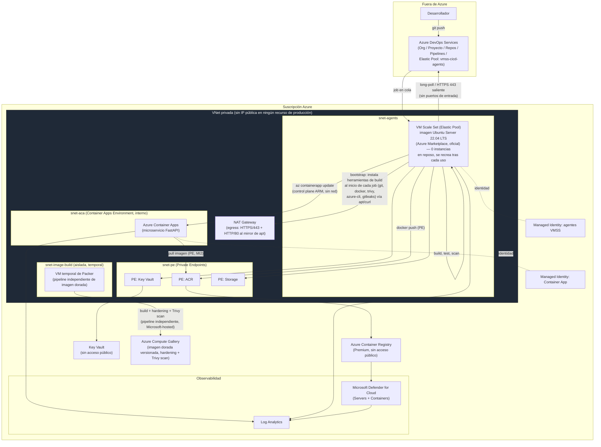

# Arquitectura de la Solución — Agentes Efímeros Seguros para Azure DevOps

> Documento de arquitectura de la prueba técnica.
> Ver también: [README.md](../README.md) (guía de reproducción y reflexión final), [infra/](../infra) (IaC), [pipelines/](../pipelines) (YAML), [app/](../app) (componente de prueba), [agent-image/](../agent-image) (imagen dorada del agente, demo).

## 1. Resumen ejecutivo

El modelo actual (VMs self-hosted de larga vida + Azure Bastion dedicado) genera costo fijo 24/7,
acumula vulnerabilidades por persistencia de estado y consume capacidad operativa en mantenimiento
manual. La propuesta reemplaza ese modelo por un **Elastic Pool de Azure DevOps sobre un Virtual
Machine Scale Set (VMSS)** — el mecanismo nativo, maduro y soportado de primera parte para agentes
self-hosted efímeros — desplegado en una red privada sin IP pública, sin Bastion, con la opción
**"Recreate agent after each use"** activada: cada agente **nace, ejecuta un único job y se
destruye por completo** (disco, caché, credenciales de proceso) sin dejar estado entre ejecuciones.

Se eligió VM Scale Set (en vez de contenedores ACI o Kubernetes) porque:

- Es la ruta **soportada nativamente por Azure DevOps** como "Azure virtual machine scale set agent
  pool" — sin necesidad de un orquestador propio de colas/eventos ni código de infraestructura
  adicional para escalar o para registrar/desregistrar agentes.
- Preserva el mismo modelo de ejecución (VM) que ya opera la organización, evitando el riesgo de
  incompatibilidad de herramientas de build (Docker-in-Docker, drivers, licencias) frente a un salto
  directo a contenedores puros.
- Azure DevOps gestiona el ciclo de aprovisionamiento/registro/destrucción del agente sobre el VMSS
  — reduce significativamente la carga operativa (problema #3 del contexto) sin que el equipo deba
  operar un clúster o un *scaler* propio.

## 2. Diagrama de arquitectura

**Nota de lectura:** ningún recurso de producción dentro de `VNET` tiene IP pública. El agente se
comunica con Azure DevOps **hacia afuera** (long-polling HTTPS/443, igual que cualquier agente
self-hosted clásico) — por eso nunca hizo falta abrir un puerto de entrada ni, por extensión, un
Bastion: el Bastion del modelo actual resolvía *acceso administrativo entrante*, no la ejecución de
pipelines. La única excepción de red es la VM temporal de `snet-image-build` (ver §4).

## 3. Modelo de agente efímero y ciclo de vida

### 3.1 Por qué VM Scale Set (Elastic Pool) frente a las alternativas

| Enfoque | A favor | En contra para este caso |
|---|---|---|
| **VM Scale Set / Elastic Pool (elegido)** | Mecanismo maduro y con soporte de primera parte de Azure DevOps (GA, no *preview*); "Recreate agent after each use" garantiza cero estado residual; integración VNet nativa; imagen base configurable (Marketplace o Compute Gallery); Azure DevOps gestiona el registro/desregistro del agente, no el equipo | Arranque en frío ~1-2 min si no hay agentes en *standby*; el equipo define la VMSS por Terraform, pero el enlace VMSS↔pool se hace una vez desde el portal de organización (no 100% IaC — ver §5 y limitaciones) |
| Contenedores bajo demanda (ACI) | Arranque rápido, *billing* por segundo | No hay integración nativa de Azure DevOps con ACI; requiere construir un orquestador propio (Function/Queue) que registre/desregistre el agente — más superficie de código propio que mantener y asegurar |
| Kubernetes (AKS + KEDA) | Muy flexible, buen *fit* si ya existe un clúster para otras cargas | Introduce el propio clúster como nueva superficie a asegurar/parchear (control plane, nodos, RBAC) — contradice el objetivo de *reducir* superficie de mantenimiento; sobredimensionado si el único consumidor es CI/CD |

Se decidió **no** usar contenedores/Kubernetes porque ambos exigen construir y mantener el
orquestador de ciclo de vida del agente nosotros mismos (el problema #3 — carga operativa — no
desaparece, se traslada). El VM Scale Set gestionado por Azure DevOps delega esa responsabilidad
mientras conserva el modelo de ejecución VM que ya es familiar para el equipo.

### 3.2 Ciclo de vida del agente

1. **Disparo**: un pipeline en Azure DevOps encola un job contra el pool `vmss-cicd-agents`.
2. **Aprovisionamiento**: si no hay un agente en *standby* (`standbyAgentCount = 0` por defecto),
   Azure escala el VM Scale Set desde 0 hacia 1 instancia, a partir de la imagen configurada en
   `infra/agent-vmss.tf` (Ubuntu Server 22.04 LTS de Azure Marketplace), dentro de `snet-agents`,
   sin IP pública, con la identidad administrada de los agentes.
3. **Registro**: la extensión de Azure Pipelines registra la VM en el pool usando la conexión de
   servicio de Azure RM basada en **Workload Identity Federation (OIDC)** configurada a nivel de
   organización — no se genera ni almacena ningún PAT.
4. **Bootstrap**: cada *job* del pipeline instala, al inicio de sus propios *steps*, exactamente las
   herramientas que necesita (ver §3.4) — la imagen base no trae nada precargado más allá de lo que
   Canonical/Microsoft incluyen por defecto, así que este paso es explícito y versionado en el
   propio YAML del pipeline, no oculto en una imagen dorada.
5. **Ejecución**: el agente ejecuta el job (build/lint/test, SAST/SCA/secretos, build+scan de
   imagen, o deploy), definidos en `pipelines/app-cicd-pipeline.yml`.
6. **Destrucción**: al finalizar el job (éxito o fallo), la opción **"Automatically tear down
   virtual machines after every use"** del Elastic Pool elimina la VM completa — disco, cachés,
   credenciales temporales de proceso y cualquier artefacto intermedio desaparecen con ella. No
   existe un paso de "limpieza" porque no hay nada que sobreviva al job.
7. **Próxima ejecución**: parte de una VM nueva, desde la misma imagen versionada de Marketplace —
   cero deriva de configuración entre builds.

Este ciclo resuelve directamente los tres problemas del modelo actual:

- **Costo**: con `standbyAgentCount = 0` y `maxAgents = 1` solo se paga cómputo mientras un job
  corre realmente.
- **Vulnerabilidades**: no hay ventana de exposición acumulada — cada VM vive minutos, no meses.
- **Carga operativa**: no hay parcheo manual, rotación de credenciales de VM, ni
  descomisionamiento; Azure DevOps gestiona el ciclo completo de la instancia.

### 3.3 Imagen base del agente y capacidad de imagen dorada

El pool en vivo arranca desde la **imagen estándar de Ubuntu Server 22.04 LTS de Azure Marketplace,
sin modificar** (`infra/agent-vmss.tf`, `source_image_reference`) — la misma que usan a diario miles
de VMs en producción, con cero incertidumbre de integración con el *fabric* de Azure. El principio
de "efímero" no depende de la imagen: lo garantiza el propio Elastic Pool (`tear down after every
use`), sin importar qué imagen arranque. Las herramientas de build se instalan al inicio de cada
job (ver §3.4) en vez de vivir precargadas.

Como capacidad adicional demostrada — y camino natural de evolución si el volumen de builds
justificara el costo de mantenimiento de una imagen propia — el repositorio incluye un **pipeline
independiente de imagen dorada** (`pipelines/agent-image-pipeline.yml`, corre en un agente
Microsoft-hosted): usa **Packer** (equivalente de un `Dockerfile` para una imagen de VM) para
construir una imagen Ubuntu endurecida (`agent-image/packer/agent.pkr.hcl`,
`agent-image/scripts/provision-agent.sh`, `agent-image/scripts/cis-hardening.sh`), la escanea con
**Trivy** antes de publicarla, y la versiona en un **Azure Compute Gallery** (`infra/gallery.tf`).
Principios aplicados en esa imagen:
- Base mínima, sin paquetes ni servicios innecesarios más allá de las herramientas de build.
- Endurecimiento tipo CIS básico: deshabilitar login por password, servicios no usados,
  `unattended-upgrades`, auditd mínimo.
- Herramientas pre-instaladas y versión pineada: `git`, Docker, Azure CLI, Trivy, `bandit`,
  `pip-audit`, `gitleaks`.
- **Sin secretos ni credenciales embebidas** — cualquier credencial se obtiene en tiempo de
  ejecución vía identidad administrada.
- Escaneada con Trivy **antes** de publicarse como nueva versión en el Compute Gallery.

### 3.4 Herramientas y pasos del pipeline de la aplicación

`pipelines/app-cicd-pipeline.yml` corre **íntegramente** sobre el Elastic Pool efímero, en cuatro
etapas secuenciales:

| Etapa | Job | Qué instala al inicio (bootstrap) | Qué hace |
|---|---|---|---|
| **Build & Test** | `build_test` | `git`, `python3-venv`, `python3-pip` | Instala dependencias (`requirements.txt` + `requirements-dev.txt`), lint con **ruff**, pruebas unitarias con **pytest** (resultados publicados como *test results*) |
| **Escaneo de seguridad** | `sast_sca_secrets` | `git`, `python3-venv`, `python3-pip`, **gitleaks** (binario de GitHub Releases) | **SAST** con `bandit` sobre el código de la app (falla sobre severidad alta), **SCA** con `pip-audit` sobre las dependencias (falla sobre CVE conocido), detección de **secretos** con `gitleaks` sobre el repo — los tres publican su reporte JSON como artefacto auditable |
| **Escaneo de seguridad** | `image_scan` | `git`, **Azure CLI**, **Docker**, **Trivy** | `az acr login` (vía Service Connection OIDC), `docker build` de `app/Dockerfile`, escaneo de la imagen con **Trivy** (`--severity HIGH,CRITICAL`, reporte publicado), `docker push` a ACR (solo si el paso anterior no lo bloquea) |
| **Deploy** | `deploy_container_app` | **Azure CLI** (+ extensión `containerapp`) | `az containerapp update` apuntando a la imagen recién publicada — falla si la revisión nueva no llega a estado sano, siendo ese el *gate* de despliegue (ver nota sobre el *smoke test* HTTP retirado más abajo) |

Cada *job* instala **solo** lo que su propio paso necesita (principio de mínimo privilegio de
herramientas, no solo de permisos) — es el costo explícito de partir de una imagen de Marketplace
sin modificar en vez de una imagen dorada precargada, documentado en README.md, "Limitaciones
conocidas".

**Nota — smoke test HTTP retirado**: el job `deploy_container_app` incluyó en su momento un paso
adicional de *smoke test* (`curl` a `/healthz` contra el FQDN interno de la Container App, desde el
propio agente). Se retiró tras confirmar en vivo que el fallo no era transitorio, sino una limitación
real de Azure Container Apps con VNet propia — ver §4 más abajo para el detalle completo y el fix de
infraestructura correspondiente (implementado en `infra/container-apps.tf`, pendiente de aplicar).

## 4. Modelo de red y aislamiento (sin Bastion dedicado)

- Una VNet (`vnet-cicd-dev`) con cuatro subredes: `snet-agents` (agentes de producción, VMSS),
  `snet-pe` (Private Endpoints), `snet-aca` (Container Apps Environment interno) y
  `snet-image-build` (subred temporal y aislada, usada solo mientras corre el pipeline independiente
  de imagen dorada).
- **Ningún recurso de producción tiene IP pública.** El Container Apps Environment se crea como
  *internal* (sin VIP pública); ACR, Key Vault y Storage solo son alcanzables vía Private Endpoint +
  Private DNS Zones (`privatelink.azurecr.io`, `privatelink.vaultcore.azure.net`,
  `privatelink.blob.core.windows.net`). La **única** excepción deliberada es la VM temporal de
  `snet-image-build`: el pipeline de imagen dorada corre en un agente Microsoft-hosted (fuera de la
  VNet), y necesita conectarse por SSH a la VM que Packer acaba de crear. Sin una IP pública ahí, no
  hay ninguna ruta de red posible entre un agente *hosted* y una IP privada. Se acepta una IP
  pública efímera con NSG restringido a TCP/22 (`infra/network.tf`,
  `AllowSSHInboundForPackerBuild`), acotada a una subred que no aloja nada permanente y una VM que
  vive solo minutos — nunca se relaja esta restricción para `snet-agents` (agentes de producción,
  que nunca tienen — ni necesitan — IP pública).
- **Egress controlado pero real**: `NAT Gateway` asociado a `snet-agents`/`snet-aca` para tener una
  IP de salida predecible y auditable. El NSG de `snet-agents` deniega todo *inbound* y permite
  *outbound* explícito a: tráfico interno de la VNet, **HTTPS/443** hacia Internet (Docker Hub,
  GitHub Releases, PyPI, repos de paquetes de las herramientas que se instalan en cada job) y
  **HTTP/80** hacia Internet, puntualmente para el mirror regional de `apt`
  (`azure.archive.ubuntu.com`), que no ofrece *listener* HTTPS — la integridad de los paquetes la
  garantiza la verificación de firmas GPG de `apt`, no el transporte. El resto de puertos de salida
  arbitrarios sigue denegado por una regla `DenyInternetOutboundDefault` explícita. En un despliegue
  de mayor madurez, esto se reemplazaría por un feed privado de Azure Artifacts (con *upstream* a los
  registries públicos) o un Azure Firewall con filtrado por FQDN, para depender de una lista
  explícita de destinos en vez de "todo HTTP(S)".
- **Por qué no hace falta Bastion**: Bastion resolvía *acceso administrativo interactivo* a VMs de
  larga vida. En el modelo efímero no hay VMs que administrar de forma rutinaria — no hay parcheo
  manual, no hay sesiones de mantenimiento periódicas. Si excepcionalmente se necesita depurar un
  agente en vivo, se usa **Azure Run Command / Serial Console** sobre el plano de control de ARM
  (autenticado con Entra ID + RBAC, sin abrir ningún puerto de red).
- **DNS del dominio interno de Container Apps con VNet propia**: se confirmó en vivo (`getent hosts`
  fallando de forma determinística en el agente, no transitoria) que Azure **no** crea
  automáticamente la Private DNS Zone del dominio por defecto del entorno
  (`internal.<env>.<región>.azurecontainerapps.io`) cuando el Container Apps Environment se despliega
  sobre una VNet propia (`infrastructure_subnet_id`, nuestro caso) en vez de dejar que el servicio
  administre su propia VNet — a diferencia de ese segundo escenario, donde sí la crea y vincula
  solo. Se resolvió siguiendo el patrón oficial de Microsoft para este escenario ("BYO VNet" +
  entorno interno, `infra/container-apps.tf`): una `azurerm_private_dns_zone` para el dominio por
  defecto del entorno, un registro A wildcard (`*`) apuntando a la IP estática interna del entorno, y
  un `azurerm_private_dns_zone_virtual_network_link` hacia la misma VNet — mismo patrón ya usado para
  ACR/Key Vault/Storage.

## 5. Gestión de secretos y credenciales

- **Registro del pool de agentes**: conexión de servicio de Azure RM con **Workload Identity
  Federation (OIDC)** — Azure DevOps intercambia un token OIDC de corta vida por acceso a la
  suscripción; no existe un PAT ni un secreto de larga vida que rotar. El enlace VM Scale
  Set↔organización de Azure DevOps (creación del Elastic Pool en sí) se hace una vez desde
  *Organization Settings*, apuntando a la Service Connection y a la VMSS ya creada por Terraform —
  no es 100% IaC de punta a punta (ver README, "Limitaciones conocidas"), pero no involucra ningún
  secreto estático.
- **Acceso a ACR**: la identidad administrada del agente y la del Container App tienen rol
  `AcrPull`/`AcrPush` vía RBAC — sin `docker login` con usuario/contraseña. En la práctica, el paso
  `az acr login --expose-token` del pipeline obtiene un token de la sesión ya abierta por la tarea
  `AzureCLI@2` a través de la Service Connection OIDC, y el `docker login` correspondiente se hace
  con ese token — nunca con una credencial estática.
- **Key Vault**: acceso solo vía identidad administrada + Azure RBAC (no *access policies* legacy),
  sin red pública, reservado para secretos de aplicación que el propio microservicio necesite en
  tiempo de ejecución (ninguno en esta demo, pero la ruta queda lista).
- **En tránsito**: todo el tráfico entre agente → ACR / Key Vault / Storage viaja por Private Link
  (TLS + red privada); el tráfico agente → Azure DevOps es HTTPS/443 saliente estándar.

## 6. Mitigación de vulnerabilidades

| Capa | Control | Tipo |
|---|---|---|
| Imagen dorada (demo) | Build mínimo + hardening + Trivy scan antes de publicar en Compute Gallery | Preventivo, auditable (reporte publicado como artefacto del pipeline de imagen) |
| Dependencias de la app | `pip-audit` sobre `requirements.txt` en cada pipeline run | Activo — falla el build si hay CVE alto/crítico |
| Código de la app | `bandit` (SAST) sobre el código Python | Activo — falla el build sobre hallazgos de severidad alta |
| Imagen del microservicio | `trivy image` sobre la imagen Docker antes de `docker push` | Auditable — ver §6.1 sobre por qué este paso puntual quedó informativo |
| Secretos en código | `gitleaks` sobre el repo en cada ejecución | Activo |
| Registro (post-push) | Microsoft Defender for Containers — reescaneo continuo de imágenes en ACR | Detección continua, no solo en el momento del push |
| Runtime | Microsoft Defender for Cloud (Defender for Servers en el pool, Defender for Containers en ACA) enviando alertas a Log Analytics | Detección y alertado — no declarativo |

Todos los resultados (Trivy/Bandit/pip-audit/gitleaks) se publican como **artefactos** dentro del
run del pipeline en Azure DevOps: quedan auditables, no son solo una casilla "habilitado" en un
documento — es el requisito no negociable de "mecanismos activos y auditables".

### 6.1 Limitación conocida: Trivy vs. contenido real de la imagen

Durante la implementación se detectó, en corridas reales del pipeline, que `trivy image` reportaba
de forma reproducible dos paquetes Python (`msgpack`, `setuptools`) con versiones **ya corregidas**
en el Dockerfile — es decir, el hallazgo persistía en el reporte de Trivy incluso después de
confirmar, con evidencia impresa directamente en el log de `docker build` (no en el reporte de
Trivy), que la imagen realmente construida ya no contenía esas versiones vulnerables.

Se investigó de forma metódica, descartando en orden:
1. **Contenido de la imagen** — verificado tres veces de forma independiente (paquetes instalados en
   el *stage* `builder`, inspección directa de la imagen final vía `docker run --entrypoint find`, y
   verificación impresa en el propio log de build tras un borrado directo del disco).
2. **Resolución de la referencia de imagen** — probado con referencia simple, con el prefijo
   `docker://`, con las atestaciones de BuildKit (`--provenance`/`--sbom`) desactivadas, y finalmente
   escaneando un archivo `.tar` concreto exportado con `docker save` (`trivy image --input`) — sin
   ninguna referencia por nombre que resolver.
3. **La propia versión de Trivy** — se fijó a `v0.55.2` (una versión madura) en vez de "la última
   disponible" del repositorio apt.

Ninguna de las tres corrigió la discrepancia. Dado el plazo de entrega, se tomó la decisión
deliberada de dejar este paso de Trivy como **informativo y auditable** (`--exit-code 0`, reporte
publicado como artefacto, resumen impreso en el log) en vez de bloqueante, documentando aquí la
investigación completa para la sustentación. El control **activo** real para estos dos paquetes
específicos queda en el propio `app/Dockerfile` (borrado directo del disco + verificación impresa en
cada build) — un mecanismo probado más confiable en este entorno que depender del *exit code* de
esta herramienta en particular. El resto de los mecanismos de la tabla anterior (Bandit, pip-audit,
gitleaks, y el propio Trivy para paquetes de sistema operativo Debian, que sí se comportaron de forma
consistente durante todas las pruebas) siguen siendo *gates* activos y bloqueantes sin cambios.

## 7. Análisis de costos

> Cifras de referencia (región East US, USD, tarifas *pay-as-you-go* públicas). Deben revalidarse
> con la Azure Pricing Calculator al momento del despliegue real — varían por región, descuentos de
> Reserved/Savings Plan y SKU exacto.

### 7.1 Modelo actual (línea base asumida)

| Componente | Supuesto | Costo mensual estimado |
|---|---|---|
| 2× VM `Standard_D4as_v5` (agentes 24/7) | $0.172/hora × 730h × 2 | **≈ $251** |
| Azure Bastion Standard (dedicado, 24/7) | $0.29/hora × 730h | **≈ $212** |
| Disco + red asociados a las VMs | estimado | **≈ $30** |
| **Total actual** | | **≈ $493/mes**, fijo, independiente del uso real |

### 7.2 Modelo propuesto

| Componente | Supuesto de uso | Costo mensual estimado |
|---|---|---|
| VM Scale Set del Elastic Pool (cómputo) | `Standard_D2s_v7`, ~40 h de build efectivo/mes, `standbyAgentCount=0`, `maxAgents=1` → $0.096/h × 40 | **≈ $4** |
| Azure DevOps *parallel job* self-hosted | 1er job gratis; si se necesita concurrencia adicional, $15/job/mes | **$0–$15** |
| Azure Container Apps (demo, *consumption*, `min replicas=0`) | Tráfico bajo, dentro del *free grant* mensual | **≈ $0–$5** |
| Azure Container Registry (Premium, requerido para Private Endpoint) | fijo | **≈ $40** |
| NAT Gateway | $0.045/h × 730h + datos procesados estimados | **≈ $35–$45** |
| Key Vault + Log Analytics + Compute Gallery (imagen dorada, demo) | uso bajo | **≈ $15–$25** |
| **Total propuesto** | | **≈ $95–$135/mes**, variable, escala con el uso real |

### 7.3 Lectura del resultado

- **Reducción estimada ≈ 70–80%** del costo fijo mensual, y lo más importante: el nuevo modelo
  **escala con el uso** (fines de semana o períodos sin desarrollo tienden a costo casi nulo de
  cómputo de agentes) en vez de ser un costo plano 24/7.
  Fuentes: [Azure Bastion pricing](https://azure.microsoft.com/en-us/pricing/details/azure-bastion/),
  [Azure VM pricing](https://azure.microsoft.com/en-us/pricing/details/virtual-machines/linux/),
  [Azure Container Apps billing](https://learn.microsoft.com/en-us/azure/container-apps/billing),
  [Azure DevOps Services pricing](https://azure.microsoft.com/en-us/pricing/details/devops/azure-devops-services/),
  [NAT Gateway pricing](https://azure.microsoft.com/en-us/pricing/details/azure-nat-gateway/).
- El **ACR Premium** ($40/mes) es, proporcionalmente, el componente fijo más caro del nuevo modelo —
  es requisito para Private Endpoint (no disponible en Basic/Standard), por lo que se acepta como
  costo del control de seguridad "sin endpoints públicos".
- **Palancas de optimización aplicadas**: `standbyAgentCount=0` y `maxAgents=1` (aceptan ~1-2 min de
  arranque en frío a cambio de costo mínimo — trade-off documentado en el README); `min replicas=0`
  en Container Apps; SKU de VM acotado por la cuota real de vCPUs de la suscripción; *retención*
  corta y *daily cap* en Log Analytics; NAT Gateway compartido entre subredes en vez de IP pública
  por recurso.
- **Trade-off seguridad vs. costo vs. disponibilidad**: se prioriza seguridad (Premium ACR, Private
  Endpoints, sin Bastion permanente) sobre el mínimo costo absoluto; se acepta latencia de arranque
  en frío (`standbyAgentCount=0`) como costo de disponibilidad a cambio de no pagar cómputo ocioso —
  ajustable a un `standbyAgentCount` mayor si el equipo prioriza velocidad sobre costo.

## 8. Seguridad en las tres capas — resumen

| Capa | Controles aplicados | Detalle |
|---|---|---|
| **Desarrollo** (código y dependencias) | Bandit (SAST), pip-audit (SCA), gitleaks (secretos), revisión de PR obligatoria | [pipelines/app-cicd-pipeline.yml](../pipelines/app-cicd-pipeline.yml), [app/](../app) |
| **Comunicación** (secretos, redes, cifrado) | OIDC/Workload Identity (sin PAT), Private Endpoints + Private DNS, TLS en tránsito, NSG deny-by-default con egress explícito, NAT Gateway para egress auditable | Secciones 4–5 de este documento |
| **Infraestructura** (config., aprovisionamiento, accesos) | IaC (Terraform), imagen dorada endurecida y escaneada (demo), identidades administradas + RBAC (sin secretos estáticos), sin Bastion permanente, Defender for Cloud | [infra/](../infra), [agent-image/](../agent-image) |

Las tres capas están conectadas por el mismo principio: **los componentes de ejecución son
transitorios**, así que la seguridad no puede depender de "asegurar una máquina" sino de asegurar
**la identidad que usa mientras vive**, **la red por la que se comunica**, y **el pipeline que la
gobierna** — que es justamente lo que persiste entre ejecuciones y, por tanto, lo único que
realmente hace falta proteger de forma continua.
